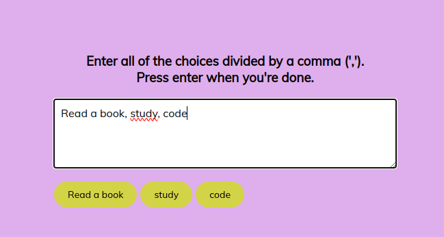
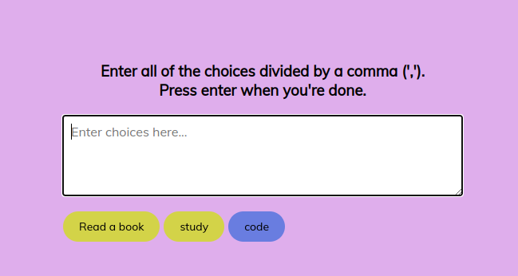

# Projeto Choice Piker

**Ele decide para você**
https://jesschuck.github.io/choice-piker/

# Resumo do projeto

O projeto é uma aplicação web simples que permite ao usuário inserir tags (ou palavras-chave) em um campo de texto (textarea). Quando o usuário pressiona a tecla 'Enter', as tags são processadas e exibidas visualmente como elementos span em um contêiner identificado pelo ID 'tags'. Além disso, há uma funcionalidade de animação que destaca aleatoriamente uma das tags em intervalos regulares, criando um efeito visual interessante.

- Você escreve quantas opções quiser e ele escolhe aleatoriamente entre uma delas para você, como nas imagens abaixo:

- Aqui ele escolhe pra você:

## Linguagens usadas:

- 
- 
- 

## Etiquetas

# Aqui está uma descrição mais detalhada do projeto:

**Entrada de Tags:**

O usuário pode digitar tags no campo de texto (textarea).
As tags são separadas por vírgulas.

**Processamento de Tags:**

Quando o usuário pressiona a tecla 'Enter', as tags são processadas.
Os espaços em branco desnecessários são removidos de cada tag.
As tags são exibidas visualmente como elementos span dentro de um contêiner (div ou span) identificado pelo ID 'tags'.

**Animação de Destaque Aleatório:**

Após a entrada das tags, uma animação é acionada.
Durante a animação, uma tag aleatória é destacada (recebe uma classe 'highlight') por um curto período de tempo.
Após o destaque, a tag retorna ao seu estado normal (a classe 'highlight' é removida).

**Limpeza do Texto:**

Após a animação, o conteúdo do campo de texto é limpo.

# Utilização:

Em resumo, é uma aplicação interativa que permite ao usuário criar e visualizar tags, com um toque adicional de animação para destacar aleatoriamente as tags. Pode ser utilizado, por exemplo, como uma ferramenta de seleção aleatória de itens, onde as tags representam os itens a serem escolhidos de forma aleátoria.

## Documentação de cores

| Cor           | Hexadecimal                                                      |
| ------------- | ---------------------------------------------------------------- |
| Body          |  #dfaeec |
| Choice button |  #d3d348 |
| Choice        |  #697de0 |
| Title         |  #000000 |

# Meus aprendizados nesse projeto:

**1. Manipulação do DOM:**

Como selecionar elementos HTML usando getElementById.
Como criar elementos HTML dinamicamente com document.createElement.
Como manipular o conteúdo e a estrutura do DOM.

**2. addEventListener em JavaScript:**

Como adicionar o addEventListener e o 'keyup'.

**3. Manipulação de Strings em JavaScript:**

Uso do método .split() para dividir uma string em um array.
Uso do método .trim() para remover espaços em branco no início e no final de uma string.

**4. Temporizadores em JavaScript:**

Uso do setTimeout para atrasar a execução de uma função.
Uso do setInterval para realizar ações em intervalos regulares.

**5. Trabalhando com Arrays em JavaScript:**

Uso de métodos de array como .filter e .map.

**6. Estilização com CSS:**

Como adicionar e remover classes em elementos HTML para modificar estilos.

**7. Animações em JavaScript:**

Implementação de animações simples utilizando temporizadores e manipulação de classes CSS.

**8. Interação do Usuário:**

Projeto envolve interações do usuário, como entrada de texto e resposta visual.

**9. Resiliência e Debugging:**

Resolução de problemas e debugging quando algo não funciona conforme o esperado.

**10. Aplicação Prática de Conceitos:**

Aplicação prática de conceitos aprendidos em JavaScript para criar uma funcionalidade específica.
